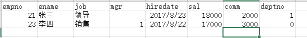

Java反射与Apache POI的应用小工具，主要功能为：

- 读取Excel中的记录到对应的ArrayList<JavaBean>集合中；
- 该工具可用于任意的（Excel-Javabean）的组合；

目录结构说明：

- com.core：主版本
- com.beta：实验代码

## 阶段一

1. Excel表中的内容：



2. Javabean：

   ```java
    	private Integer empno;
       private String ename;
       private String job;
       private Integer mgr;
       private Date hiredate;
       private Double sal;
       private Double comm;
       private Integer deptno;
   ```

   并有对应属性的get/set方法。

3. 读取Excel：

   ```java
   		EtBUtil<Emp> tool = EtBUtil.<Emp>create(Emp.class);
   
   		try {
   			List<Emp> emps = tool.read(getClass().getResource("/").getPath() + "source.xls");
   			// do something
   		} catch (IllegalAccessException e) {
   			e.printStackTrace();
   		} catch (InstantiationException e) {
   			e.printStackTrace();
   		}
   ```

   